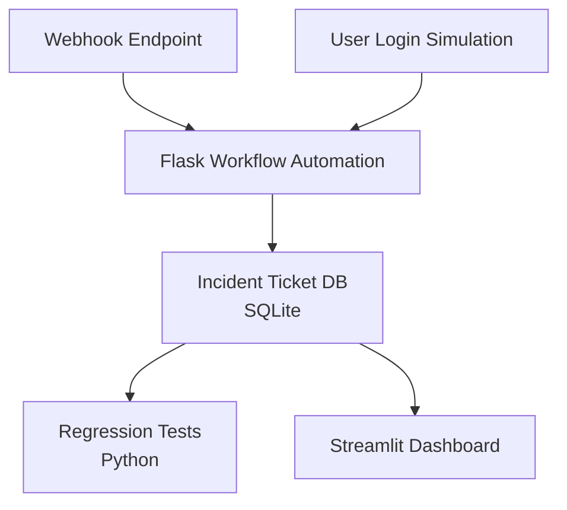

# Quality Automation and Operational Dashboard Tool

A fully functional prototype of a Quality Automation and Operational Dashboard Tool that simulates internal workflows and testing processes for a client operations team — inspired by the internship job description from Securitas.

## Project Overview

This system mimics a real-world business use case: handling support/incident tickets, automating their routing and resolution tracking, running test scripts for validation, and displaying key operational metrics on a live dashboard.

The project demonstrates competence in:

- Power Automate-style workflow automation (implemented in Python/Flask)
- SQL-based data querying and updates
- Regression-style test scripting
- Dashboarding and data visualization
- Clean code architecture and technical documentation

## How This Project Maps to the Securitas Internship

This project directly addresses the key requirements from the Securitas Client Operations Quality Automation internship:

- **Workflow Automation**: Implements automated ticket routing and assignment rules similar to Power Automate using APIs and SQL, matching the "Automate workflows in Power Automate using APIs and T-SQL" requirement
- **Regression Testing**: Includes a comprehensive test suite that validates business rules and data integrity, fulfilling the "Develop and maintain automated test cases for regression testing" requirement
- **Data Visualization**: Features a Streamlit dashboard with multiple visualization components, aligning with "Create dashboards in Oracle Data Visualization (DV)" requirement
- **Technical Documentation**: Provides clear architecture diagrams and setup instructions, addressing the "Create structured technical documentation" requirement

## System Architecture

## Components

### 1. Database (SQLite)

- Stores incident tickets with fields for status, priority, assignment, etc.
- Contains mock data generated using Python Faker

### 2. Workflow Automation (Python/Flask)

- Processes new tickets based on priority and status
- Automatically assigns tickets to appropriate personnel
- Includes webhook endpoint for external integrations
- Features user login simulation for access control

### 3. Regression Test Suite

- Validates workflow automation triggers
- Ensures data integrity and consistency
- Verifies business rules are enforced
- Outputs test results to logs

### 4. Streamlit Dashboard

- Displays ticket volume overview
- Shows priority breakdown
- Visualizes analyst workload
- Provides live feed of recent tickets
- Includes filtering capabilities

## Getting Started

Detailed setup and usage instructions will be added as the project progresses.

## License

This project is created for educational purposes.
