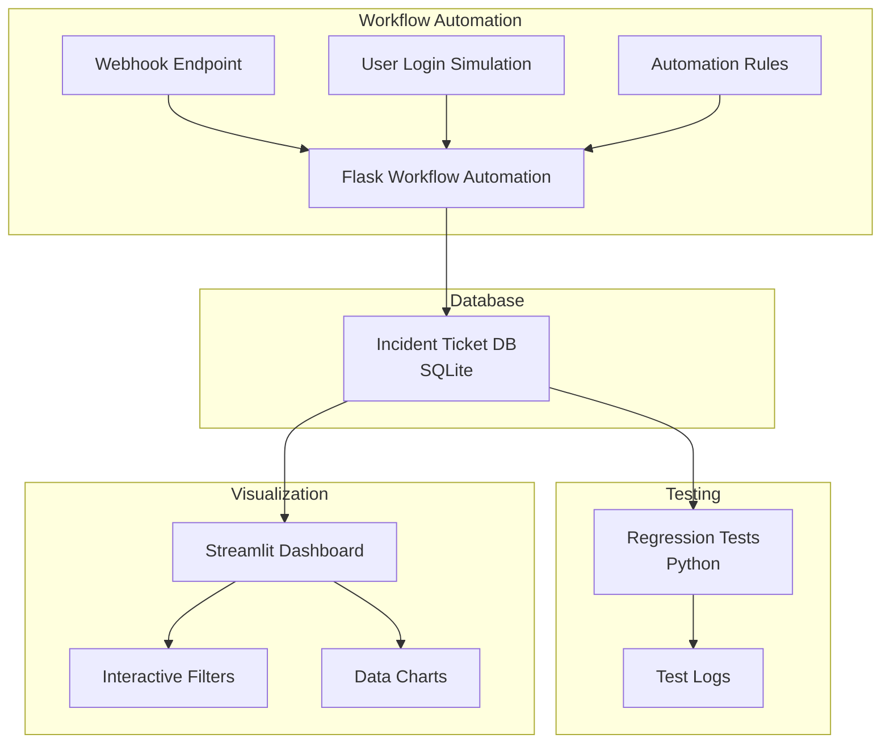

# Architecture Documentation

## System Overview

The Quality Automation and Operational Dashboard Tool is designed to simulate internal workflows and testing processes for a client operations team. The system handles support/incident tickets, automates their routing and resolution tracking, runs test scripts for validation, and displays key operational metrics on a live dashboard.

## Architecture Diagram

## Component Details

### 1. Database (SQLite)

The database component uses SQLite for simplicity and portability. It consists of a single `tickets` table with the following schema:

| Column Name | Type    | Description                                |
|-------------|---------|--------------------------------------------|
| id          | INTEGER | Primary key                                |
| title       | TEXT    | Short summary of the issue                 |
| description | TEXT    | Detailed explanation                       |
| status      | TEXT    | Enum: ['open', 'in_progress', 'closed']    |
| priority    | TEXT    | Enum: ['low', 'medium', 'high']            |
| created_at  | DATETIME| Timestamp when ticket was created          |
| updated_at  | DATETIME| Timestamp when ticket was last updated     |
| assigned_to | TEXT    | Simulated user or bot name                 |

The database is populated with 100 mock entries using Python's Faker library to simulate a realistic environment.

### 2. Workflow Automation (Python/Flask)

The workflow automation component is implemented using Flask and provides the following functionality:

1. **Automation Rules**:
   - High priority tickets are automatically assigned to "Senior Analyst" and set to "in_progress"
   - Low priority tickets are automatically assigned to "SupportBot"

2. **API Endpoints**:
   - `GET /api/tickets` - List all tickets
   - `GET /api/tickets/{id}` - Get a specific ticket
   - `POST /api/tickets` - Create a new ticket
   - `PUT /api/tickets/{id}` - Update a ticket

3. **Webhook Endpoint**:
   - `POST /webhook/ticket` - External webhook for ticket creation
   - Simulates integration with external systems

4. **User Login Simulation**:
   - Simple authentication system with predefined users
   - Role-based access (admin, analyst, support)

### 3. Regression Test Suite

The test suite validates the system's functionality and business rules:

1. **Test Cases**:
   - **Workflow Automation Trigger**: Verifies that high-priority tickets are automatically assigned to Senior Analyst and set to in_progress
   - **Status Integrity Check**: Ensures all closed tickets have an updated_at timestamp within the last 30 days
   - **Priority Escalation Rule**: Tests that low-priority tickets cannot be set to in_progress without proper assignment
   - **Data Consistency**: Ensures no ticket has null values in required fields

2. **Test Logs**:
   - Test results are saved as JSON files in the test_logs directory
   - A summary report is generated with overall test statistics

### 4. Streamlit Dashboard

The dashboard provides visualization of key metrics:

1. **Ticket Volume Overview**:
   - Bar chart of ticket counts by status
   - Line chart of tickets created per day (last 14 days)

2. **Priority Breakdown**:
   - Pie chart showing percentage of tickets in each priority level

3. **Analyst Load**:
   - Bar chart showing number of tickets per assigned analyst

4. **Live Feed**:
   - Table showing the latest 10 tickets with key information

5. **Filters**:
   - Status filter
   - Priority filter
   - Date range filter

## Communication Flow

1. **Ticket Creation**:
   - Tickets can be created via the API or webhook endpoint
   - Automation rules are applied during creation
   - Events are logged to automation_logs

2. **Ticket Updates**:
   - Updates trigger automation rules when applicable
   - Status changes are validated against business rules
   - Updated tickets are immediately reflected in the dashboard

3. **Testing**:
   - Tests run against the live database
   - Test results are logged to test_logs
   - Violations of business rules are detected and reported

4. **Dashboard**:
   - Connects directly to the database
   - Provides real-time visualization of ticket data
   - Allows filtering to focus on specific subsets of data

## Deployment

The system is designed to be deployed in the following ways:

1. **Local Development**:
   - Run components individually for testing and development
   - Database, workflow, and dashboard can all run locally

2. **Production Deployment**:
   - Streamlit dashboard can be deployed to Streamlit Cloud
   - Flask application can be deployed to a web server
   - Database can be migrated to PostgreSQL for production use

## Security Considerations

1. **Authentication**:
   - Simple user authentication system
   - Role-based access control

2. **Data Validation**:
   - Input validation on all API endpoints
   - Business rule enforcement

3. **Logging**:
   - Comprehensive logging of all system activities
   - Audit trail for ticket changes

## Future Enhancements

1. **Advanced Analytics**:
   - Predictive models for ticket resolution time
   - Anomaly detection for unusual ticket patterns

2. **Integration**:
   - Email notification system
   - Chat platform integration

3. **Performance**:
   - Caching for dashboard performance
   - Database optimization for larger datasets
